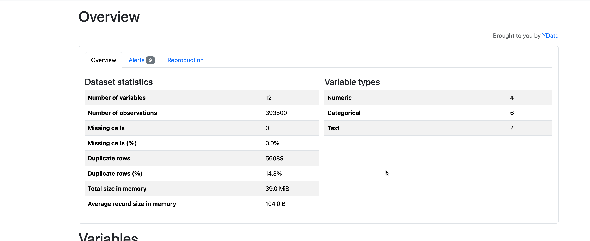

#  What drives the price of a car

## Project Overview

This project aims to predict the price of used cars using machine learning techniques. By analyzing a dataset of used car sales, we identify key factors that influence pricing and develop a predictive model to estimate vehicle value accurately. This information is valuable for both buyers and sellers in the automotive market, enabling informed decision-making and optimized sales strategies.

### Key Questions Addressed

- What are the primary factors that drive the price of a used car?
- How do these factors interact with each other to influence pricing?
- Can we build a model to accurately predict the price of a used car based on its features?

### Goals

- Identify the most important features that impact car prices.
- Develop a robust regression model for price prediction.
- Provide actionable insights for optimizing car sales strategies.

### Data

The dataset used in this project is sourced from Kaggle and contains information on 426,880 used cars. This dataset was reduced from an original set of 3 million records to facilitate faster processing and analysis. 
The GitHub cannot upload greater than 25GB, so the file was compressed & uploaded in the same data folder
 [Link to vehicles Dataset](data/vehicles.csv)
[ Link to vehicles Dataset zip file ](data/vehicles.csv.zip)

### Analysis 

The analysis was conducted using the Python programming language and the libraries 
 
| Category             | Libraries                                                                                                                               |
| -------------------- | --------------------------------------------------------------------------------------------------------------------------------------- |
| Data Manipulation    | pandas, numpy                                                                                                                           |
| Visualization        | seaborn, matplotlib, plotly.express                                                                                                     |
| Machine Learning     | sklearn (preprocessing, compose, pipeline, model selection, linear_model, metrics, feature selection, inspection)                       |
| Encoding             | category_encoders                                                                                                                       |
| Text Processing      | re                                                                                                                                      |
| EDA                  | ydata_profiling                                                                                                                         |

The specifics of the analysis, data understanding, missing data analysis, data preparation, including the code, visualizations, comments, and observations, model comparison, and best model evaluation are available in the following Jupyter Notebook.

[Link to Jupyter Notebook](/AIML_PA_prompt_II.ipynb)

## Methodology

We employ the CRISP-DM (Cross-Industry Standard Process for Data Mining) methodology to ensure a structured and repeatable approach to data analysis. This framework is industry-agnostic and technology-independent, making it ideal for large-scale data mining projects. It helps reduce costs, improve reliability, and accelerate project timelines.

## Business Understanding

Understanding the factors influencing used car prices is crucial for used car dealers. By analyzing 426,880 used car sales records, this project aims to guide dealerships in making data-driven decisions to enhance their inventory and sales strategies.

## Data Understanding

The dataset contains detailed information about used car sales. Below is an overview of the data, post cleaning validation, identifying outliers,  generated using the `ProfileReport` library from `ydata_profiling`.

### Missing Data Analysis

A heatmap visualization highlights the distribution of missing values in the dataset.
#### BarPlot

#### HeatMap 

#### Summary of Missing Data and Actions Taken:

| Column         | Missing % | Action Taken                                                                 |
|----------------|-----------|------------------------------------------------------------------------------|
| `id`           | 0%        | Removed (not useful for regression).                                         |
| `region`       | 0%        | Retained.                                                                   |
| `price`        | 7.7%      | Removed records with zero values.                                            |
| `year`         | 0.3%      | Filled with the most common value.                                           |
| `manufacturer` | 4.1%      | Filled with "Other" (categorical column).                                    |
| `model`        | 1.2%      | Filled with "Other" (categorical column).                                    |
| `condition`    | 40.8%     | Filled with the most common value.                                           |
| `cylinders`    | 41.6%     | Cleaned and filled with the most common value.                               |
| `fuel`         | 0.7%      | Filled with "Other" (categorical column).                                    |
| `odometer`     | 1%        | Filled with the mean value.                                                  |
| `title_status` | 1.9%      | Filled with the most common value.                                           |
| `transmission` | 0.6%      | Filled with "Other" (categorical column).                                    |
| `VIN`          | 37.7%     | Removed (high percentage of missing values).                                 |
| `drive`        | 30.6%     | Removed (high percentage of missing values).                                 |
| `size`         | 71.8%     | Removed (high percentage of missing values).                                 |
| `type`         | 21.8%     | Filled with "Other" (categorical column).                                    |
| `paint_color`  | 30.5%     | Removed (high percentage of missing values).                                 |
| `state`        | 0%        | Retained.                                                                   |

## Data Preparation

We handled missing data, performed data cleaning, identified outliers, and conducted post-cleaning EDA using the `ProfileReport` library from `ydata_profiling`.

### Handling Missing Values

The following actions were taken to address missing values:

- Removed columns with high percentages of missing data.
- Filled categorical columns with "Other" or the most common value.
- Filled numerical columns with the mean or mode as appropriate.

### Data Cleaning Steps

- Removed records with `price = 0`.
- Dropped irrelevant columns (`id`, `VIN`, `region`, `size`, `paint_color`, `drive`).
- Applied transformations to clean and standardize data (e.g., removing "cylinders" text, replacing invalid values).

### Post-Cleaning Results

A heatmap confirms that missing values have been addressed.

### Identifying Outliers

Outliers in the `price` column were identified using the IQR method. The safe range for prices was determined to be between $100 and $70,000.

## Modeling

Multiple regression models were tested to identify the best fit for the data:

1. Simple Linear Regression
2. Linear Regression with Polynomial Features (GridSearchCV)
3. Ridge Regression with Polynomial Features (GridSearchCV)
4. Lasso Regression with Polynomial Features (GridSearchCV)
5. Linear Regression with Sequential Feature Selector (GridSearchCV)

The number of car sales, by amount and price.

### Best Model

The `Linear Regression with Polynomial Features` model was identified as the best fit, based on its low Mean Squared Error (MSE) and high R² score.

## Evaluation

### Mean Squared Error (MSE)

The `Linear Regression with Polynomial Features` model demonstrated the lowest MSE.

### R² Score

The model also achieved the highest R² score, confirming its accuracy.

### Feature Importance

Using Permutation Importance, the most impactful features were identified:

Key features include:
- `Year`: Newer cars or vintage models are more expensive.
- `Odometer`: Higher mileage reduces car value.
- `Cylinders`: Indicates engine size and performance.

## Data Correlation

Correlation analysis reveals strong relationships between price and key features:

## Deployment

### Feature Categorization

#### Year Categories:
- `Vintage`: 1919–1930
- `Antique`: Pre-1975
- `Classic`: Pre-2000
- `Modern`: 2000–2017
- `New Model`: 2017–Present

#### Odometer Categories:
- `New`: <15K miles
- `Low`: 15K–40K miles
- `Medium`: 40K–70K miles
- `High`: >70K miles

### Classified Data

## Insights from Visualizations

### Prices by Year Category vs Fuel Type

- Gas vehicles dominate in value.
- Hybrid cars show a gradual increase in adoption.

### Total Price by Manufacturing Year

- Cars manufactured in 2018 are the most valuable.

### Top Models by Year and Odometer

- Ford F-150 and Chevrolet Silverado are the most sought-after models.

- Consumers prefer vehicles with medium to high mileage.

### Evaluating 2018 (Most priced cars) and the distribution of top models & Odometer

When going deeper into the data for vehicles manufactured in 2018, I found the Ford F-150 as one of the best options for customers. They are looking for Ford F-150 with Low and Medium mileage mainly.

### Price for cars manufactured in 2018 by model

This graph complements the previous data as we can see here what the most priced models manufactured in 2018 are. We found the Ford F150 and Chevrolet Silverado in the top two, with the Ford F150 representing almost double the second place.

## Findings

1. Cars manufactured 4 years ago are most preferred.
2. The Ford F-150 and Chevrolet Silverado are top-performing models.
3. Gas-powered vehicles dominate the market.
4. High-mileage vehicles are popular in the $6,000–$20,000 price range.

## Recommendations

1. Focus on acquiring Ford F-150 and Chevrolet Silverado models.
2. Maintain an inventory of vehicles with medium to high mileage.
3. Monitor trends in hybrid and electric vehicles for future opportunities.
4. Improve data quality to enhance model performance.
5. Test the model with new data entries for validation. What Drives the Price of a Car?
